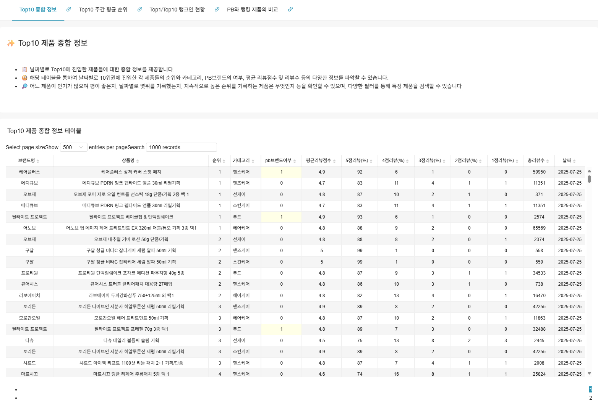
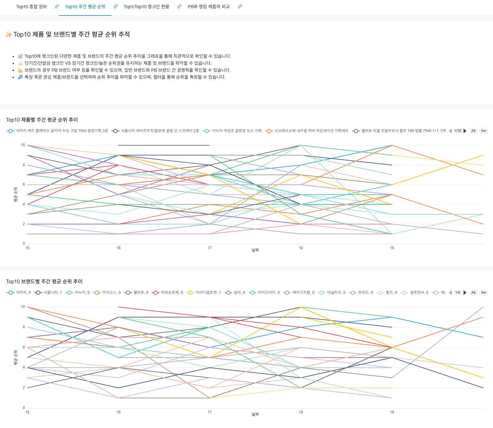
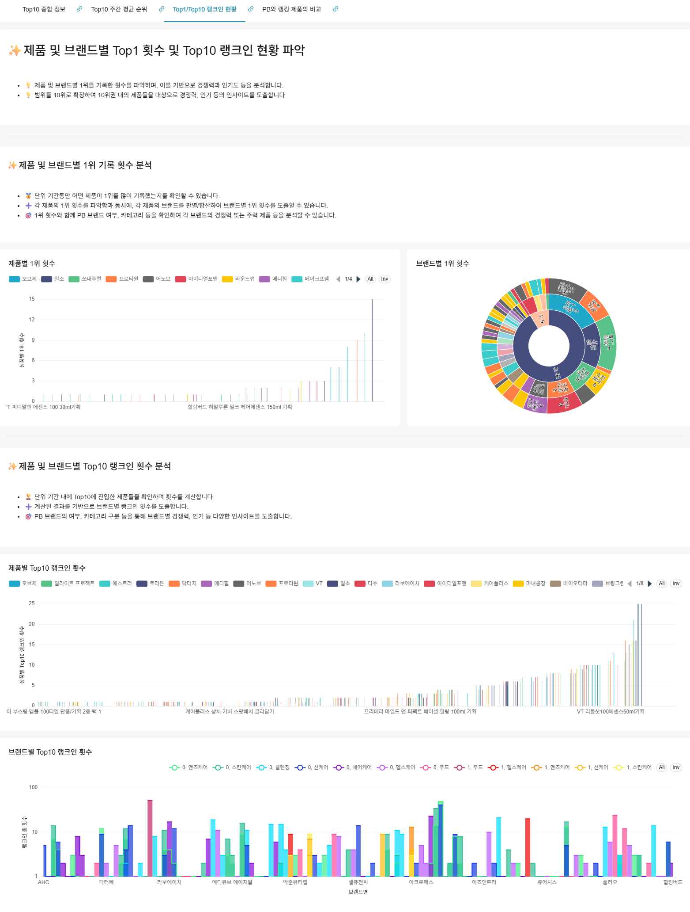
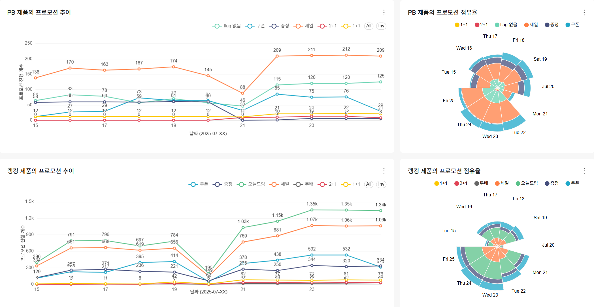
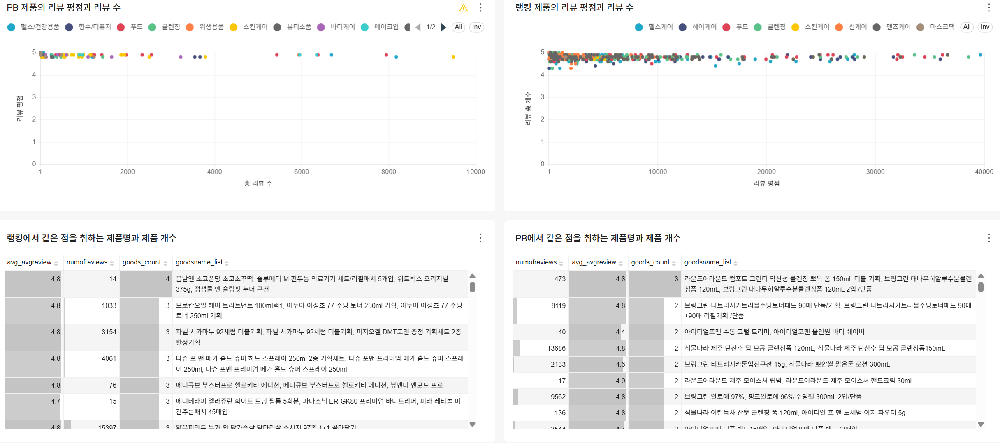
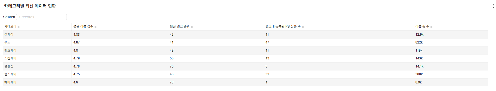
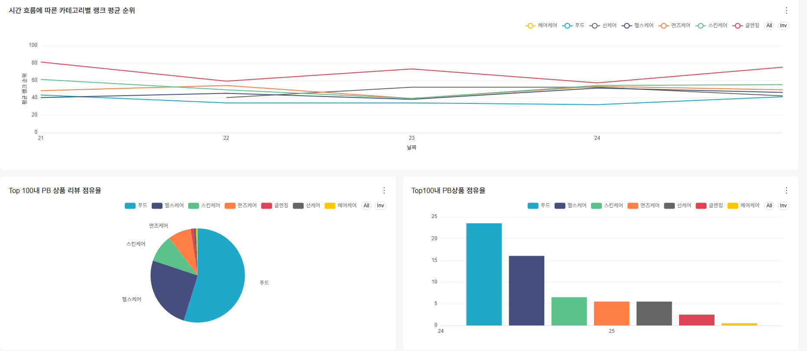
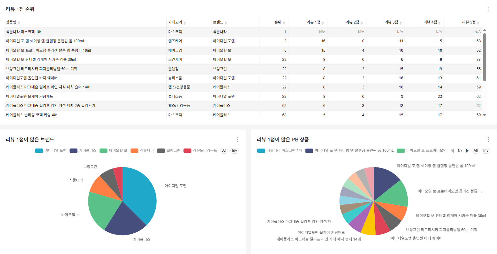
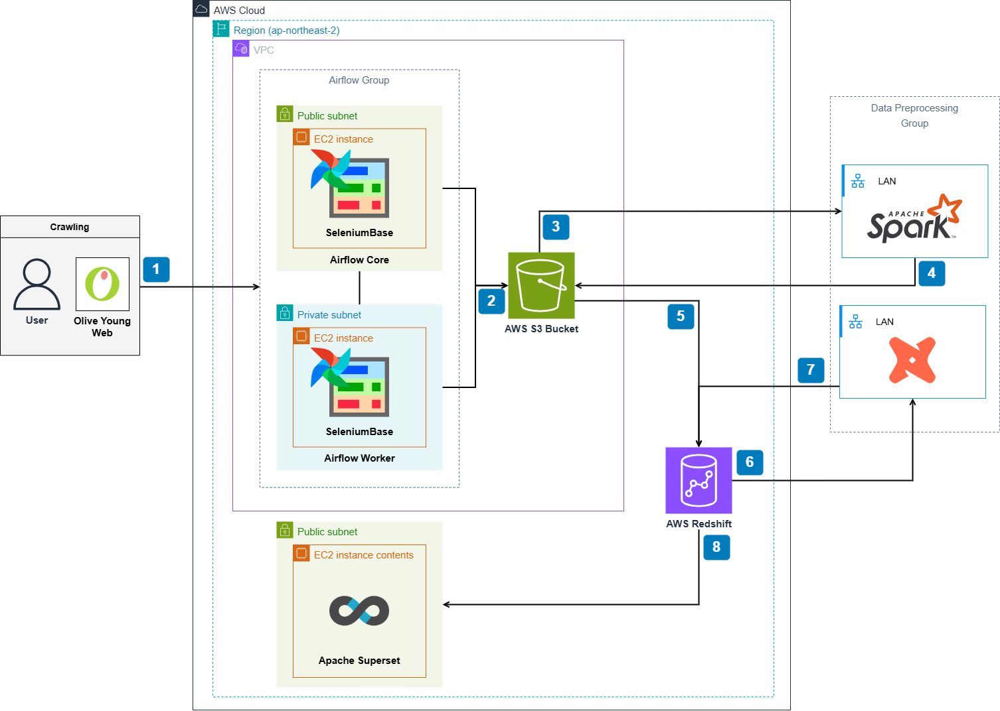
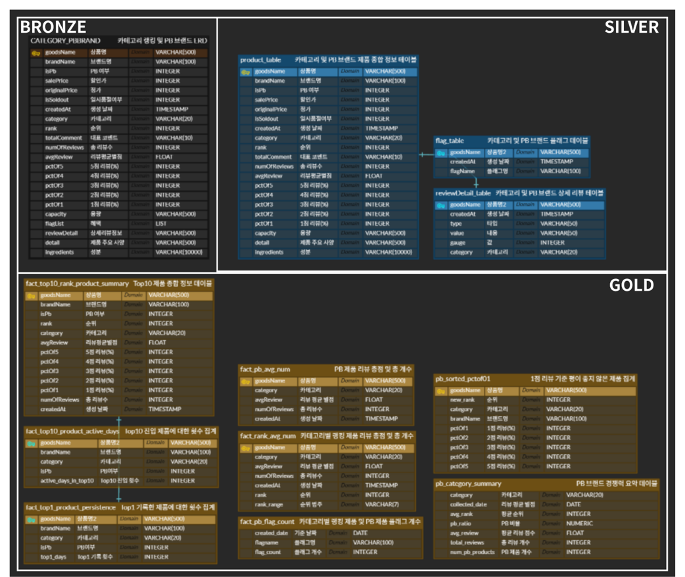

#  너무 많은 올리브영 속 잇템, 우리가 비교해줄게! 

> 올리브영 브랜드별 리뷰 및 평점 데이터 수집·정제·적재 AWS 기반 데이터 파이프라인·대시보드 구축  &nbsp;&nbsp; • <b>Data Engineering</b>

## Project Overview.

올리브영 **PB·Non-PB 브랜드 리뷰 및 평점 데이터**를 대상으로 **수집·정제·적재를 자동화한 데이터 파이프라인을 구축**하고,  

마케팅 전략 수립에 활용 가능한 **소비자 반응 인사이트를 차트 대시보드로 제작**한 프로젝트입니다.

  

## Contributors

|  |  |  |  |  |
|:--:|:--:|:--:|:--:|:--:|
| 김서경 [@kimwestg](https://github.com/kimwestg) | 박범수 [@goosebumpsu](https://github.com/goosebumpsu) | 🧑‍💻 정준 [@jjunier](https://github.com/jjunier) | 오주언 [@sulsikan](https://github.com/sulsikan) | 유연준 [@MochaSyrup](https://github.com/MochaSyrup) |

  

## Tech Stack

| Category | Tools |
|----------|-------|
| **Language** |  |
| **Data Pipeline / ETL** |     |
| **Cloud / Infra** |    |
| **Visualization / Monitoring** |  |
| **Communication / Collab** |    |

  

## Dashboard

<!-- 랭킹 Top 10 대시보드 (1) -->

### `랭킹 Top 10 종함`

| 

 |
|---|
|카테고리별 Top 100 중 상위 10개 제품의 **날짜·순위·PB 여부·평점/리뷰수** 정보를 제공하고, **검색·필터**로 스테디셀러/프로모션 등 인사이트를 빠르게 확인합니다.|

  

<!-- 랭킹 Top 10 대시보드 (2) -->

### `Top 10 주간 평균 순위`

| 

  |
|---|
|**Top 10 제품·브랜드**의 **주간 평균 순위 추이**를 조건별로 추적해 **순위 변동성과 랭크인 성과**를 비교하고, **PB와 일반 브랜드 경쟁력**을 분석합니다.|

  

<!-- PB 랭킹 제품 비교 -->

### `Top 1 / Top 10 랭크인 현황`

| 

  |
|---|
|전체 수집 기간 기준으로 제품·브랜드의 **1위 횟수**와 **Top 10 랭크인 횟수**를 합산해 정량 비교하고, **카테고리·PB 여부별 강세**를 한눈에 파악합니다.|

  

<!-- PB 랭킹 비교 -->

### `PB와 랭킹 제품 비교`

| 

  |
|---|
|PB와 랭킹 제품의 **프로모션 구성/변화**를 비교해 PB는 **세일 중심(다양성 제한)**, 랭킹 제품은 **오늘드림·쿠폰·증정** 등 **다채로운 조합**으로 운영되는 차이를 보여주며 **PB 프로모션 다변화 필요성**을 도출합니다.|

| 

  |
|---|
|PB는 **리뷰 수는 적지만 고평점**이 많아 **품질 경쟁력 신호**를 보여주고, 랭킹 제품은 **리뷰 수가 크게 많아 사회적 증거 기반 신뢰**가 강해 **PB의 리뷰 확보·바이럴 전략 필요성**을 도출합니다.|

  

<!-- PB 상품 요약 -->

### `PB 상품 요약 정보`

| 

 |
|---|
|전날 기준 카테고리별 **평균 평점·평균 순위·PB 개수·총 리뷰 수**와 시간 흐름에 따른 **PB 평균 순위 변화**, Top100 내 **PB 리뷰/상품 점유율**을 제공해 강세 카테고리와 보완 영역을 정량 파악합니다.|

  

<!-- PB 상품 리뷰 -->

### `1점 리뷰가 많은 PB 상품`

| 

  |
|---|
|**1점 리뷰**가 집중된 **PB 상품/브랜드**를 **점수 분포·비율**과 함께 제시하고, 제품별 **1점 리뷰 규모**를 시각화해 **품질 개선 우선순위** 및 **평판·CS 전략** 수립에 활용합니다.|

  

## Architecture

  

## ERD

